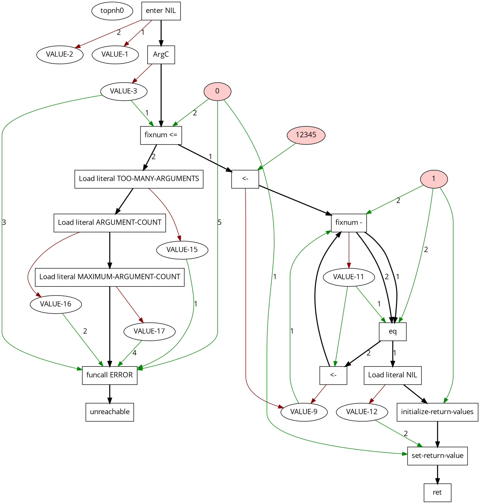

# SICL hacking tools

Some "scripts" which I use to help me work on SICL.

## cleavir-dot

Draws IR using Graphviz, which is slow but often looks better than the
IR visualizer for small functions.

A little demo:

```lisp
(let ((n 12345))
 (loop
    (cleavir-primop:let-uninitialized (p)
    (if (cleavir-primop:fixnum-sub n 1 p)
        (progn)
        (progn))
    (setq n p))
    (when (cleavir-primop:eq n 1) (return))))
```



## sicl-fuzz-test

Generates random Lisp forms and waits for one to break the SICL
compiler.
